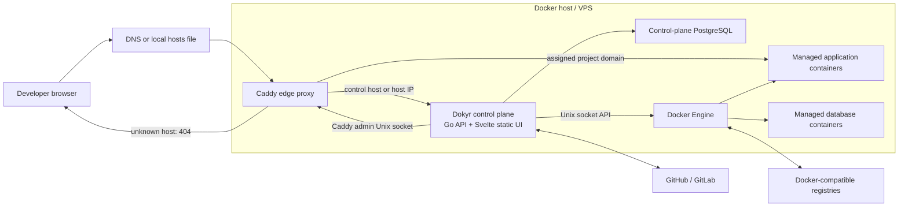
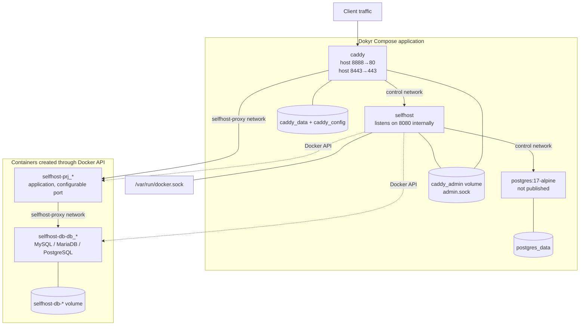
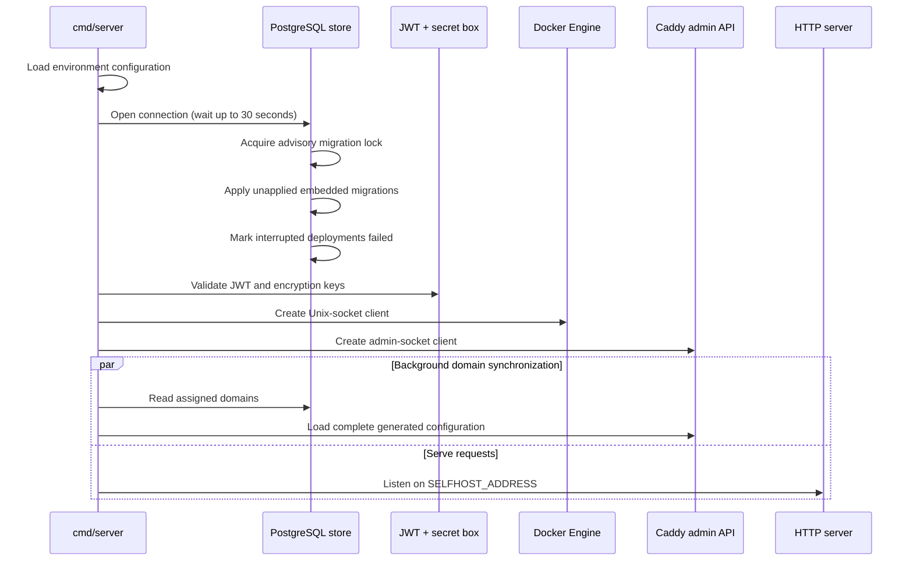
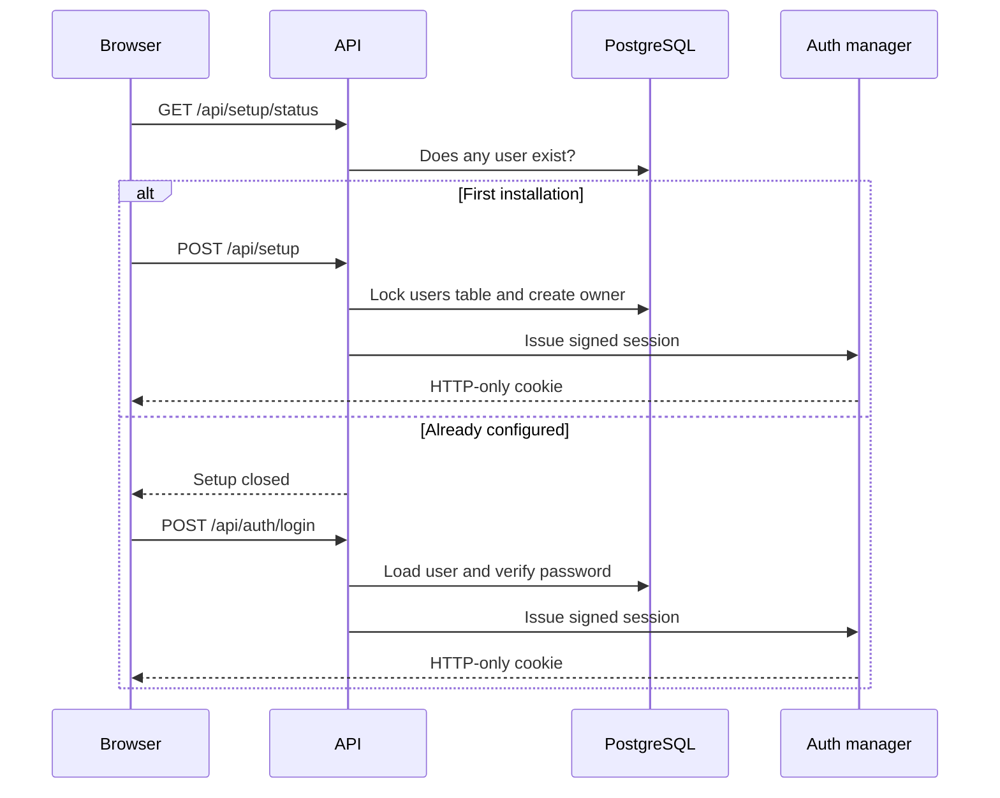
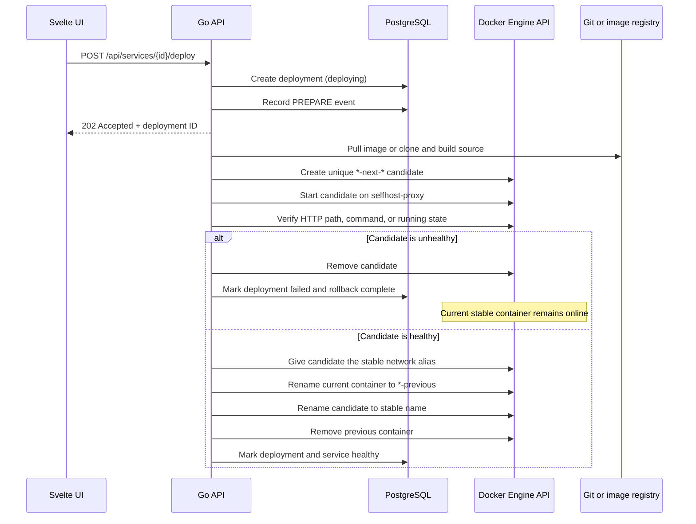
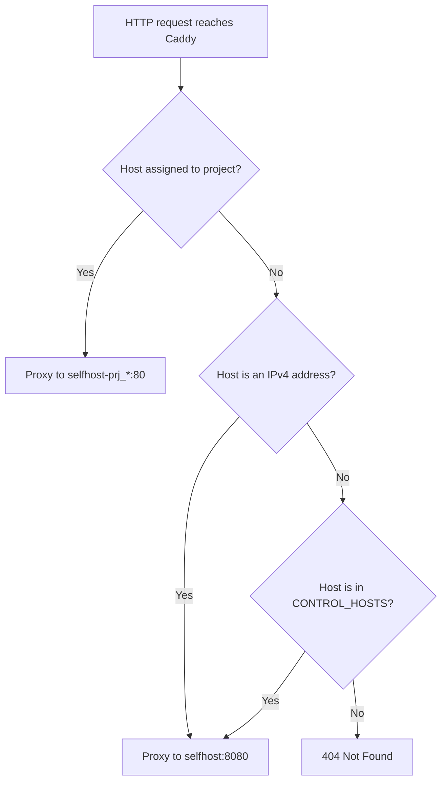
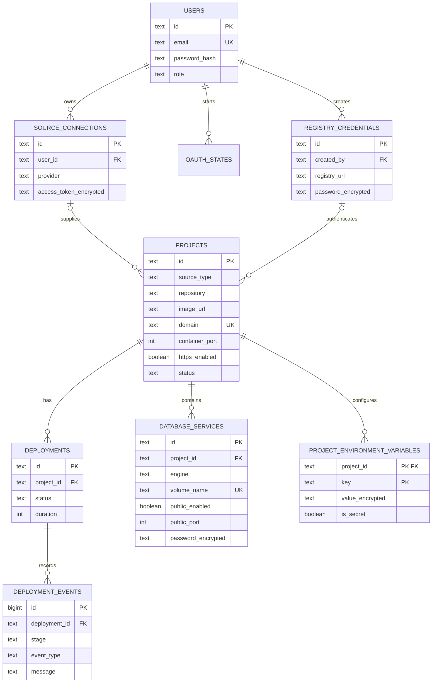

# Dokyr architecture

This document describes the system that is implemented in this repository today. It is intended both for people operating Dokyr and for AI agents changing the code. It separates current behavior from planned capabilities so that the code is not mistaken for a more complete platform than it is.

## 1. Purpose and current scope

Dokyr is a lightweight, single-node deployment control plane. It runs as one Go process with an embedded static Svelte application, stores control-plane data in PostgreSQL, controls the host Docker Engine through its Unix socket, and configures a separate Caddy container through Caddy's admin API.

The current release can:

- create the first owner account and authenticate with a JWT stored in an HTTP-only cookie;
- connect GitHub and GitLab accounts through OAuth and list private repositories;
- store private Registry V2 credentials;
- create and deploy image-based projects;
- stream image-pull and container-start progress into deployment events;
- view application container logs by polling the API;
- assign a domain to an application through Caddy;
- configure each application's private container port and choose HTTP-only or automatic HTTPS ingress;
- inspect managed routes and safely validate/apply or reset runtime Caddyfile overrides from the Proxy screen;
- save encrypted environment variables and recreate the container without pulling or rebuilding its image;
- create private-by-default MySQL, MariaDB, and PostgreSQL services with persistent volumes;
- optionally publish a database on an explicitly selected host port.

Repository discovery exists, but cloning and building a repository is **not implemented yet**. A repository-backed project cannot currently be deployed. The runtime is also single-node: it has no worker fleet, scheduler, clustering, or high-availability coordination.

## 2. System context



The key architectural decision is that Dokyr does not embed a Docker daemon or a reverse proxy. It is a control plane over the host's existing Docker Engine, while Caddy remains the data-plane entry point for HTTP traffic.

## 3. Containers, networks, ports, and volumes

The supplied `compose.yaml` starts three platform containers.



| Resource | Purpose | Exposure |
|---|---|---|
| `control` network | Private communication among Dokyr, Caddy, and metadata PostgreSQL | Docker-internal network |
| `selfhost-proxy` network | Caddy-to-workload and workload-to-database communication | Docker bridge network, not itself public |
| `/var/run/docker.sock` | Lets Dokyr call the Docker Engine API | Mounted only in the Dokyr container |
| `caddy_admin` | Shares Caddy's admin Unix socket with Dokyr | No TCP admin port |
| `postgres_data` | Persists control-plane records | Docker volume |
| `caddy_data`, `caddy_config` | Persists certificates and Caddy state | Docker volumes |
| `selfhost-db-*` volumes | Persist managed database data | One named volume per database service |

By default, Caddy publishes HTTP on host port `8888` and HTTPS on `8443`, which avoids collisions with other local services. Set `HTTP_PORT=80` and `HTTPS_PORT=443` on a VPS when those ports are available.

## 4. Code map

| Path | Responsibility |
|---|---|
| `cmd/server/main.go` | Composition root: configuration, dependencies, startup synchronization, static UI, HTTP server |
| `internal/config` | Environment-variable configuration and control-host parsing |
| `internal/api` | HTTP routes, validation, authentication boundary, orchestration, JSON responses |
| `internal/auth` | Password hashing, JWT creation/verification, HTTP-only session cookie middleware |
| `internal/store` | PostgreSQL access, migrations, and persistent domain models |
| `internal/store/migrations` | Ordered, embedded SQL migrations; the database schema's source of truth |
| `internal/runtime` | Docker Engine API client for health, image pull, containers, logs, databases, and restart |
| `internal/caddy` | Domain validation, HTTP/HTTPS route rendering, health checks, and atomic configuration through the admin socket |
| `internal/integration` | GitHub/GitLab OAuth, provider APIs, and private repository discovery |
| `internal/secretbox` | AES-GCM encryption/decryption for stored secrets |
| `web/src/routes` | SvelteKit screens; the browser application is client-rendered |
| `web/src/lib` | Shared authentication client, shell, status, icons, and design tokens |
| `Dockerfile` | Multi-stage frontend/API build and minimal Alpine runtime image |
| `compose.yaml` | Reference single-host production topology |
| `Caddyfile` | Bootstrap proxy configuration; runtime domain changes replace it through the admin API |

The backend deliberately uses the Go standard `net/http` router. The Docker integration also talks directly to Docker's HTTP API instead of importing the full Docker SDK, keeping the binary and dependency graph small.

## 5. Process startup



Migrations run before the API starts. An advisory lock prevents two instances from applying the same migration concurrently, although the rest of the system is designed and tested as a single control-plane instance.

## 6. Authentication and first-run setup

The public endpoints are health, setup status, initial setup, login/logout, and OAuth callbacks. Project, deployment, database, dashboard, and integration endpoints pass through JWT middleware.



Initial user creation locks the `users` table inside a transaction, so concurrent setup attempts cannot create multiple owners. Public registration closes as soon as one user exists.

## 7. Application deployment and zero-downtime promotion

Application services can deploy a registry image or clone and build a Git repository. Every application-service deployment uses a candidate container so the current release remains available until the replacement passes its configured health check.



Application containers follow these invariants:

- stable name: `selfhost-svc-<service-id>`;
- candidate name: `selfhost-svc-<service-id>-next-<unique-suffix>`;
- labels: `selfhost.managed=true`, `selfhost.project.id=<id>`, and `selfhost.service.id=<id>`;
- network: `selfhost-proxy`;
- application port: service-defined `container_port` (`80` by default);
- no random host port is published;
- restart policy: `unless-stopped`;
- `no-new-privileges` is enabled.

The stable container name is also the private hostname used by Caddy. A candidate is never assigned that stable alias until it passes verification. If candidate creation, startup, or verification fails, only the candidate is removed and the current release continues serving traffic.

Deployment execution runs in a background goroutine with a 15-minute timeout. Progress is persisted in `deployment_events`; the UI polls, so reconnecting does not lose the event history. A control-plane restart marks deployments left in `deploying` or `building` as failed.

## 8. Environment update without redeploy

Environment values are encrypted in PostgreSQL. Saving the Environment screen intentionally recreates the existing container without pulling an image and without cloning or building source.

```mermaid
sequenceDiagram
    participant UI
    participant API
    participant DB
    participant Docker

    UI->>API: PUT /api/projects/{id}/environment
    API->>API: Validate keys and duplicates
    API->>API: Encrypt every value
    API->>Docker: Inspect current container
    Docker-->>API: Image, config, host config, existing env
    API->>Docker: Stop and rename container to backup
    API->>Docker: Create replacement with merged env
    API->>Docker: Start and inspect replacement
    alt Replacement remains running
        API->>Docker: Delete backup container
        API->>DB: Transactionally replace encrypted variables
        API-->>UI: Updated service
    else Create/start/verify fails
        API->>Docker: Remove replacement
        API->>Docker: Restore and restart backup
        API-->>UI: Error; stored values stay unchanged
    end
```

The database write happens after runtime success. This ordering prevents the UI from reporting values that the current container did not accept. Existing image-defined environment variables are preserved unless a saved key replaces them; removed saved keys are removed from the new container.

## 9. Domain routing

The initial `Caddyfile` exposes the control plane only for an IPv4 Host header or a hostname in `SELFHOST_CONTROL_HOSTS`. Every other unassigned hostname returns 404.

When a project domain, container port, or TLS mode changes, the API validates it, reads all assigned domains, renders a complete Caddyfile, and sends it to `POST /load` through `/run/caddy-admin/admin.sock`. HTTP-only routes proxy directly on the HTTP listener. Automatic-HTTPS routes use a hostname site block so Caddy obtains and renews certificates, while HTTP requests redirect to HTTPS.

The global **Proxy** screen displays Caddy connectivity, managed domains, exact upstreams, TLS state, and the generated Caddyfile. Advanced edits are applied as runtime overrides through the same admin API. Caddy validates them and retains the previous working configuration when a load fails. A **Restore managed** action regenerates configuration from PostgreSQL. Runtime overrides are intentionally not the source of truth and may be replaced by a later project route change.



For a local hostname such as `hello.test`, map it to `127.0.0.1`, assign `hello.test` in the project, and browse `http://hello.test:8888` with the default ports. On a VPS, point an A record to the server and normally publish Caddy on 80/443.

## 10. Managed database flow

Supported presets are MySQL 8.4, MariaDB 11.8, and PostgreSQL 17 Alpine. Creation generates a dedicated named volume and container, sets engine-specific initialization variables and a health check, and joins the service to `selfhost-proxy`.

Database services are private by default. Their internal hostname is the container name and their port is the engine's normal port. Public access requires an explicit opt-in and an available host port. Credentials are encrypted in control-plane PostgreSQL; they are revealed only through an authenticated endpoint.

Removing a project removes its application and database containers. Database-volume deletion is a separate, materially destructive choice and must remain explicit in future UI/API changes.

## 11. Persistent data model



Migration rules:

1. Never edit a migration that may already have run.
2. Add the next zero-padded file under `internal/store/migrations`, for example `0008_feature_name.sql`.
3. Make the forward migration safe for the data already allowed by previous releases.
4. Add or update store tests for behavior affected by the schema.
5. The SQL files are embedded into the Go binary; rebuilding the image is sufficient to ship them.

Applied filenames are recorded in `schema_migrations`. Each migration runs in its own transaction while a PostgreSQL advisory lock is held.

## 12. Configuration reference

| Variable | Default | Meaning |
|---|---|---|
| `SELFHOST_ADDRESS` | `:8080` | Go HTTP listen address inside the container |
| `SELFHOST_FRONTEND_DIR` | `/app/web/build` in the image | Built Svelte static files |
| `DATABASE_URL` | local development URL | Control-plane PostgreSQL connection string |
| `SELFHOST_JWT_SECRET` | insecure development value | Signs session JWTs; use at least 32 random characters |
| `SELFHOST_JWT_ISSUER` | `selfhost` | JWT issuer claim |
| `SELFHOST_COOKIE_SECURE` | `false` | Set `true` when the panel is served over HTTPS |
| `SELFHOST_PUBLIC_URL` | `http://localhost:8080` | Base URL used to construct OAuth callbacks |
| `SELFHOST_ENCRYPTION_KEY` | insecure development value | Derives the AES-GCM key for stored credentials and environment values |
| `GITHUB_CLIENT_ID`, `GITHUB_CLIENT_SECRET` | empty | GitHub OAuth application |
| `GITLAB_CLIENT_ID`, `GITLAB_CLIENT_SECRET` | empty | GitLab OAuth application |
| `GITLAB_BASE_URL` | `https://gitlab.com` | GitLab SaaS or self-managed base URL |
| `CADDY_ADMIN_URL` | `unix:///run/caddy-admin/admin.sock` | Caddy admin API transport |
| `SELFHOST_CONTROL_HOSTS` | `localhost` | Space/comma/semicolon-separated panel host allowlist |
| `HTTP_PORT` | `8888` | Compose-only Caddy HTTP host port |
| `HTTPS_PORT` | `8443` | Compose-only Caddy HTTPS TCP/UDP host port |
| `POSTGRES_PASSWORD` | insecure development value | Compose control-plane database password |

Keep `SELFHOST_ENCRYPTION_KEY` stable. Losing or changing it makes saved provider tokens, registry passwords, database passwords, and environment values unreadable. Rotating it requires a deliberate decrypt-and-re-encrypt migration, which does not exist yet.

## 13. Security and trust boundaries

The Docker socket is the most important boundary in this architecture. Access to it is effectively root-equivalent access to the Docker host. Compromising the Dokyr process may therefore compromise the VPS, regardless of the container's dropped capabilities.

Operational requirements:

- expose the control panel only on intended hostnames or a trusted management address;
- use HTTPS and `SELFHOST_COOKIE_SECURE=true` outside local development;
- replace every development secret in `.env.example` with long random values;
- never mount the Docker socket into Caddy, PostgreSQL, or managed workloads;
- keep Caddy's admin API on its shared Unix socket, not a public TCP listener;
- restrict who may reveal database credentials or update environment variables;
- back up PostgreSQL, Caddy data, and every managed database volume;
- review image provenance because deployed images run on the same Docker host;
- treat public database exposure as exceptional and firewall published ports at the VPS layer.

AES-GCM protects secrets at rest in PostgreSQL, but the encryption key is present in the Dokyr container environment and plaintext is necessarily passed to Docker/provider APIs at runtime. This is application-level encryption, not protection from a fully compromised control plane.

## 14. Build, run, and verify

Build and run the full reference topology:

```sh
cp .env.example .env
# Replace every development credential in .env.
docker compose up -d --build
curl http://localhost:8888/api/health
```

Run code checks:

```sh
go test ./cmd/... ./internal/...
cd web && pnpm check && pnpm build
```

Use the published control-plane image in a Compose override:

```yaml
services:
  selfhost:
    image: brahoul/selfhost:latest
    build: null
```

The image contains only the Dokyr process and built web application. It still requires PostgreSQL, a reachable Docker Unix socket, and Caddy with the shared admin socket. The repository's `compose.yaml` is the canonical description of those dependencies.

Useful runtime checks:

```sh
docker compose ps
docker compose logs -f selfhost
docker compose logs -f caddy
docker inspect selfhost-<project-id>
docker network inspect selfhost-proxy
```

## 15. Change guide for maintainers and AI agents

Preserve these invariants unless an architecture change explicitly replaces them:

1. **API boundary:** new project/runtime endpoints belong behind `auth.Require`; only setup, login/logout, health, and provider callbacks are public.
2. **Schema history:** add migrations; never rewrite applied SQL.
3. **Secret handling:** encrypt provider tokens, registry passwords, database passwords, and environment values before storage; never return encrypted blobs as if they were usable credentials.
4. **Docker ownership:** managed resources use `selfhost.*` labels and deterministic names. Never enumerate or delete unrelated host containers or volumes.
5. **Networking:** applications and managed databases join `selfhost-proxy`; applications do not publish random host ports; Caddy routes assigned domains.
6. **Caddy safety:** generate the complete desired host map and keep the final 404 fallback. Never route an unknown hostname to the panel.
7. **Failure recovery:** application deployments must keep the previous stable container online until the candidate passes verification. A failed candidate is removed without changing the stable release.
8. **Database privacy:** managed databases remain private unless the user explicitly enables a validated, unique public port.
9. **UI/API contract:** Svelte routes use the shared API wrapper so a 401 returns the user to login. Long-running progress is persisted and polled rather than held only in browser memory.
10. **Resource limits:** Docker responses and log reads are bounded. Keep request validation and limits when adding streaming or richer log features.

When tracing a feature, start at the Svelte route, locate its `/api/...` call in `internal/api/api.go`, then follow persistence into `internal/store/store.go` or host actions into `internal/runtime/docker.go` / `internal/caddy/client.go`. The composition root in `cmd/server/main.go` shows every runtime dependency.

## 16. Known limitations and logical next boundaries

- Deployment and log updates use polling; there is no WebSocket or server-sent-event transport.
- There is no job queue, worker process, concurrency controller, deployment cancellation, or distributed lock for deployments.
- The system manages one Docker Engine and does not schedule across servers.
- There is no automatic backup/restore workflow, secret rotation workflow, audit log, rate limiting, or fine-grained authorization enforcement beyond authenticated access.
- Caddy configuration is rebuilt from database state; direct manual runtime changes may be overwritten on the next domain synchronization.
- Zero-downtime promotion is local to one Docker Engine. It protects service availability during a release but does not provide multi-node high availability if the host or Docker daemon fails.

The clean expansion point for repository builds and multi-node operation is a durable jobs table plus a separately deployable worker/agent. Keep provider credentials and desired project state in the control plane; give workers narrowly scoped execution credentials instead of exposing the central Docker socket over TCP.
