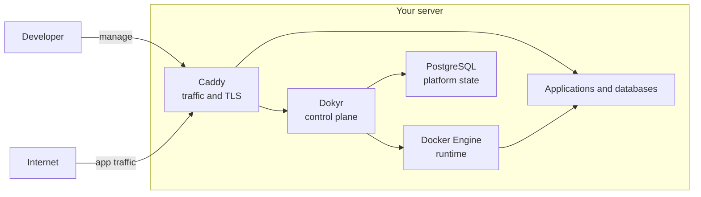
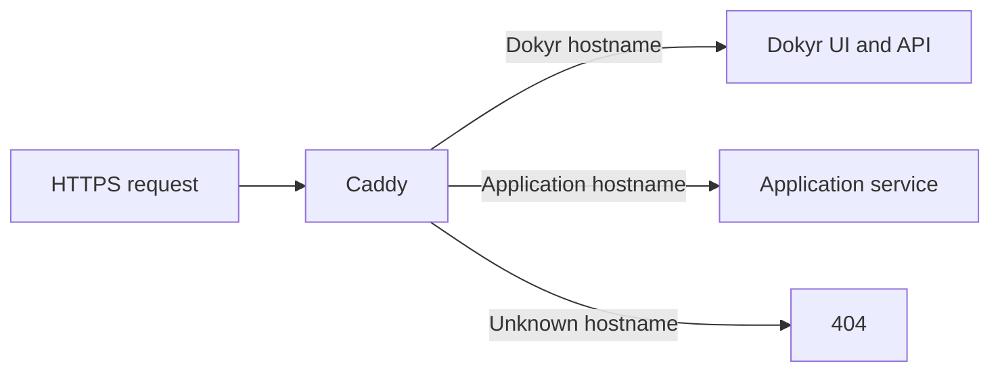
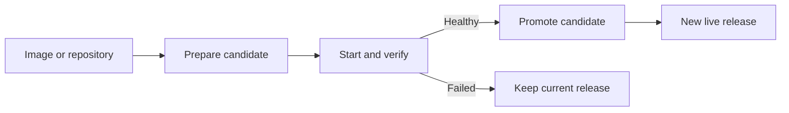
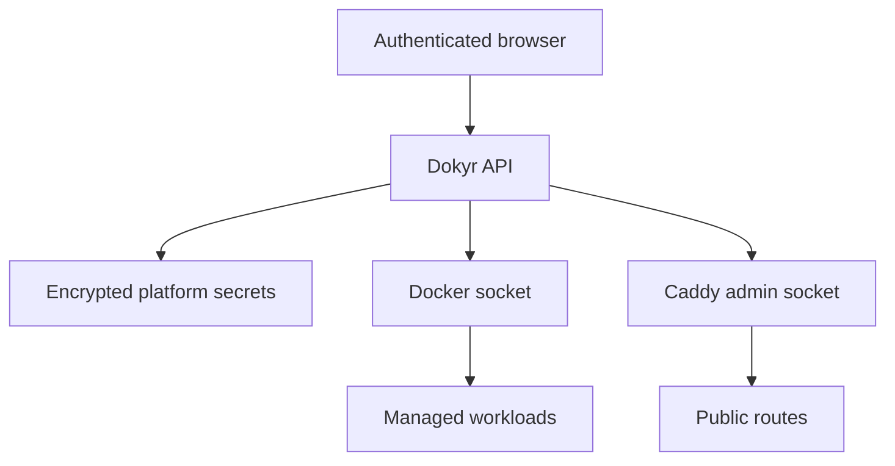

# Dokyr architecture

Dokyr is a single-server deployment platform. It provides a small control plane over Docker and uses Caddy as the public entry point for applications running on the host.

This page intentionally stays at the system level. For operational detail, use the [configuration reference](/reference/configuration), [deployment guide](/guide/deployments), and [security model](/operations/security).

## System overview

```mermaid
flowchart LR
    Developer["Developer"]
    Internet["Internet"]

    subgraph Server["Your server"]
        Caddy["Caddy<br/>traffic and TLS"]
        Dokyr["Dokyr<br/>control plane"]
        Docker["Docker Engine<br/>runtime"]
        Data["PostgreSQL<br/>platform state"]
        Services["Applications and databases"]
    end

    Developer -->|"manage"| Caddy
    Internet -->|"app traffic"| Caddy
    Caddy --> Dokyr
    Caddy --> Services
    Dokyr --> Data
    Dokyr --> Docker
    Docker --> Services
```

The responsibilities are deliberately separated:

- **Dokyr** manages projects, configuration, deployments, domains, credentials, and operational state.
- **Docker Engine** creates and runs application and database containers.
- **Caddy** terminates TLS and routes each hostname to the correct service.
- **PostgreSQL** stores control-plane records. Application data remains in its own service volumes.

Dokyr does not replace Docker or embed a reverse proxy. It coordinates both through their local APIs.

## Request routing

```mermaid
flowchart LR
    Request["HTTPS request"] --> Caddy["Caddy"]
    Caddy -->|"Dokyr hostname"| UI["Dokyr UI and API"]
    Caddy -->|"Application hostname"| App["Application service"]
    Caddy -->|"Unknown hostname"| Missing["404"]
```

Caddy is the only HTTP entry point. The hostname determines whether traffic reaches the Dokyr control plane or a managed application. Services communicate privately inside Docker networks and are not published to random host ports.

## Deployment lifecycle

```mermaid
flowchart LR
    Source["Image or repository"] --> Prepare["Prepare candidate"]
    Prepare --> Verify["Start and verify"]
    Verify -->|"Healthy"| Promote["Promote candidate"]
    Verify -->|"Failed"| Keep["Keep current release"]
    Promote --> Live["New live release"]
```

Each deployment is prepared as a candidate while the current release stays online. Dokyr promotes the candidate only after its configured health check succeeds. If preparation or verification fails, the candidate is removed and the existing release continues serving traffic.

Deployment events are persisted so progress remains visible when the browser reconnects.

## Platform capabilities

At a high level, Dokyr manages:

- application services and deployments;
- domains, TLS, and service routing;
- PostgreSQL, MySQL, and MariaDB services;
- private container images and source integrations;
- environment variables and encrypted credentials;
- object storage, backups, registry, and developer mail;
- users, permissions, and control-plane updates.

The platform is intentionally designed for one Docker host. It does not include a worker fleet, multi-node scheduler, clustering, or high-availability coordination.

## Trust boundaries

```mermaid
flowchart TB
    Browser["Authenticated browser"] --> API["Dokyr API"]
    API --> Secrets["Encrypted platform secrets"]
    API --> DockerSocket["Docker socket"]
    API --> CaddySocket["Caddy admin socket"]
    DockerSocket --> Workloads["Managed workloads"]
    CaddySocket --> PublicTraffic["Public routes"]
```

The Docker and Caddy sockets are the platform's most privileged boundaries. Access is restricted to the Dokyr container. User-facing operations pass through authentication and permission checks before they can affect runtime resources.

Application containers remain separate from the control-plane database and do not receive Dokyr's platform credentials.

## Where to go deeper

| Topic | Documentation |
|---|---|
| Install and first run | [Installation](/guide/installation) |
| Project deployment behavior | [Deployments](/guide/deployments) |
| Domains and HTTPS | [Domains and HTTPS](/infrastructure/domains) |
| Registry and storage | [Private registry](/infrastructure/registry) · [Object storage](/infrastructure/storage) |
| Backup and recovery | [Backups and restores](/operations/backups) |
| Security boundaries | [Security model](/operations/security) |
| Environment and server settings | [Configuration reference](/reference/configuration) |
| HTTP endpoints | [API reference](/API) |
